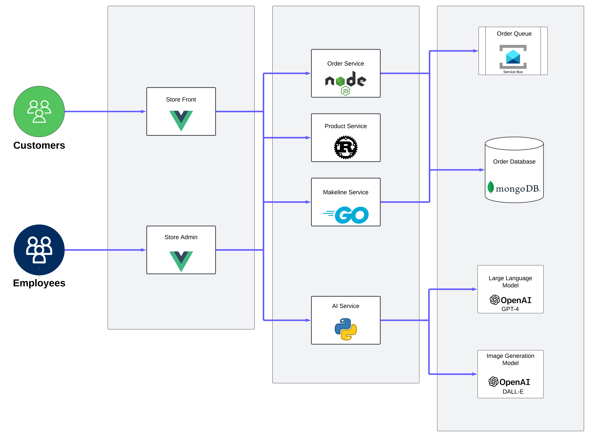

# Lab Project Assignment #2: Cloud-Native App for Best Buy

## **Scenario**

This peoject demonstrate a building of cloud-native application to be deployed in a Kubernetes Cluster. The application architecture follows the design principles of the [Algonquin Pet Store (On Steroids)](https://github.com/ramymohamed10/algonquin-pet-store-on-steroids). Order Queue Service is refcatored to utilzied a mangaed backing service, in this case Azure Service Bus.

The project implements an AI-powered product Descriptions and image generation using GPT-4 and DALL-E.

## Application Architecture



## Application and Architecture

### 1. **Store-Front (Vue.js)**

A simple front-end that that simulates a store front. It allows customers to add items to a cart and submit orders. It interacts with the order-service to process orders.

The store-front is used in conjunction with the product-service and order-service. It interacts via REST APIs to fetch data such as product listings and order details.

### 2. **Store-Admin (Vue.js)**

An admin portal for managing products and manually processing orders. It communicates with product-service and makeline-service.

The Store-Admin service is another web application, similar to Store-Front, but designed for internal store management. It is meant to be used in conjunction with the product-service and makeline-service.

### 3. **Order-Service (Fastify)**

A REST API that handles order submissions by adding orders to a message queue, which can be processed by other services.

This service operates as a backend API that handles order-related requests. It is a simple REST API that allows you to add an order to a message queue that supports the AMQP 1.0 protocol. It is meant to be used in conjunction with the store-front app.

### 4. **Product-Service (Rust)**

A product catalog API that allows fetching, updating, and adding products. Products are stored in memory (non-persistent).

This app allows you to get a list of products, get a single product, update a product, and add a product through a RESTful API and it is meant to be used in conjunction with the store-front and store-admin apps.

### 5. **Makeline-Service (Golang)**

A REST API that processes orders from a Azure Service Bus queue and stores processed orders in a MongoDB database.

This service works as soon as the user place an order. It is meant to be used in conjunction with the store-admin app which process orders from a Azure Service Bus queue and send them to a MongoDB database.

### 6. **AI-Service (FastAPI)**

This service rely on Azure OpenAI to generate product descriptions and images via the store-admin portal.

The AI-Service interacts with OpenAI models using Semantic Kernel SDK. It is meant to be used in conjunction with the store-admin app.

## Deployment Instructions

### Prerequisites:

---

1. Containerize with Docker: Ensure each microservices are containerized and build the Docker image and ensure it is ready for cloud-based environments.
2. Azure Services: Ensure `Azure Service Bus` and `Azure OpenAI` is configured and secretsa re included in the yaml fiel

### Step 1: Install `kubectl`

---

1. **What is `kubectl`?**

   - `kubectl` is a command-line tool you will use to deploy applications, configure clusters, and inspect resources.

2. **Installing `kubectl`:**

   - Follow the official installation guide to install `kubectl` on your system.
   - [kubectl Installation Guide](https://kubernetes.io/docs/tasks/tools/)

3. **Verify `kubectl` Installation:**
   - Confirm that `kubectl` is properly set up by running:
     ```bash
     kubectl version --client
     ```

### Step 2: Create an Azure Kubernetes Cluster (AKS)

---

1. **Log in to Azure Portal:**
   - Go to [https://portal.azure.com](https://portal.azure.com) and log in with your Azure account.
2. **Create a Resource Group:**
   - In the Azure Portal, search for **Resource Groups** in the search bar and create a resource group.
3. **Create an AKS Cluster:**
   - In the search bar, type **Kubernetes services** and click on it.
   - Click **Create** and select **Kubernetes cluster**
   - Fill in the the `Basics` details
   - Fill in the `Node pools` details:
   - Click **Review + Create**, and then **Create**.
4. **Connect to the AKS Cluster:**
   - Once the AKS cluster is deployed, navigate to the cluster in the Azure Portal.
   - In the overview page, click on **Connect**.
   - Select **Azure CLI** tap. You will need Azure CLI.
   - Login to your azure account using the following command:
     ```
     az login
     ```
   - Set the cluster subscription using the command shown in the portal:
     ```
     az account set --subscription 'subscribtion-id'
     ```
   - Copy the command shown in the portal for configuring `kubectl`:
     ```
     az aks get-credentials --resource-group <DEMO> --name <YOUR-CLUSTER>
     ```
   - Verify Cluster Access:
     - Test your connectio with the following command and you should see details of the nodes in your AKS cluster if the connection is successful:
     ```
     kubectl get nodes
     ```

### Step 3: Deploy the ConfigMaps and Secrets

- Create and Deploy the Secret for OpenAI API:
  - Replace the secret with your Base64-encoded OpenAI API key.
  ```bash
  kubectl apply -f secrets.yaml
  ```
- Verify:
  ```bash
  kubectl get secrets
  ```

### Step 4: Deploy the Algonquin Pet Store Application

---

1. **Apply the YAML file to the AKS cluster:**

   - Use the K8s deployment YAML files provided under `Deployment Files\Service` to deploy each microservices or use the ` algonquin-pet-store-all-in-one.yaml` to deploy All.
   - Open the terminal and run the following command to apply the YAML configuration and deploy the application to AKS.
     ```
     kubectl apply -f <yaml-file-name>.yaml
     ```
     ```
     kubectl apply -f algonquin-pet-store-all-in-one.yaml
     ```

2. **Verify the deployment:**
   - Verify that the pods are running by using the following command:
     ```bash
     kubectl get pods
     ```
   - Confirm that all services are up and running:
     ```bash
     kubectl get services
     ```
3. **Access the Application:**

   - Locate its EXTERNAL-IP in the Azure Portal under **Kubernetes Services** > **YOUR-CLUSTER** > **Services** and **ingresses**.

4. **Test the Store Front and Store Admin:**

   - Use the external IP addressfound in step 3 to access the Store Front and Store Admin.

## Microservice Repositories

The application has the following services:

| **Service**        | **Repository Link**                                                       |
| ------------------ | ------------------------------------------------------------------------- |
| `Store-Front`      | [Store-Front](https://github.com/princefelix-23/store-front-A2)           |
| `Store-Admin`      | [Store-Admin](https://github.com/princefelix-23/store-admin-A2)           |
| `Order-Service`    | [Order-Service](https://github.com/princefelix-23/order-service-A2)       |
| `Product-Service`  | [Product-Service](https://github.com/princefelix-23/product-service-A2)   |
| `Makeline-Service` | [Makeline-Service](https://github.com/princefelix-23/makeline-service-A2) |
| `AI-Service`       | [AI-Service](https://github.com/princefelix-23/ai-service-A2)             |

## Docker Images

The application has the following docker images:

| **Service**        | **Docker Image Link**                                                          |
| ------------------ | ------------------------------------------------------------------------------ |
| `Store-Front`      | [Store-Front](https://hub.docker.com/r/princefelix23/store-front-a2)           |
| `Store-Admin`      | [Store-Admin](https://hub.docker.com/r/princefelix23/store-admin-a2)           |
| `Order-Service`    | [Order-Service](https://hub.docker.com/r/princefelix23/order-service-a2)       |
| `Product-Service`  | [Product-Service](https://hub.docker.com/r/princefelix23/product-service-a2)   |
| `Makeline-Service` | [Makeline-Service](https://hub.docker.com/r/princefelix23/makeline-service-a2) |
| `AI-Service`       | [AI-Service](https://hub.docker.com/r/princefelix23/ai-service-a2)             |

## CI/CD Pipeline Implementation

Each microservice is equipped with Continuous Integration/Continuous Deployment (CI/CD) pipeline to automate building, and deploying the application.

The application's CI/CD:

| **Service**        | **Docker Image Link**                                                                              |
| ------------------ | -------------------------------------------------------------------------------------------------- |
| `Store-Front`      | [Store-Front](https://github.com/princefelix-23/store-front-A2/actions/runs/12088493516)           |
| `Store-Admin`      | [Store-Admin](https://github.com/princefelix-23/store-admin-A2/actions/runs/12088656369)           |
| `Order-Service`    | [Order-Service](https://github.com/princefelix-23/order-service-A2/actions/runs/12088641140)       |
| `Product-Service`  | [Product-Service](https://github.com/princefelix-23/product-service-A2/actions/runs/12088648796)   |
| `Makeline-Service` | [Makeline-Service](https://github.com/princefelix-23/makeline-service-A2/actions/runs/12088632648) |
| `AI-Service`       | [AI-Service](https://github.com/princefelix-23/ai-service-A2/actions/runs/12090957949)             |

## Demo Video

[Youtube Video Link](https://youtu.be/-AyRi96mLK0)
